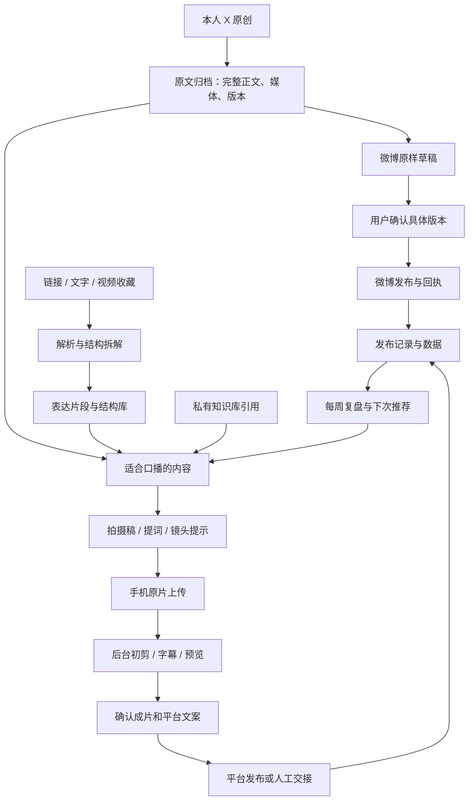
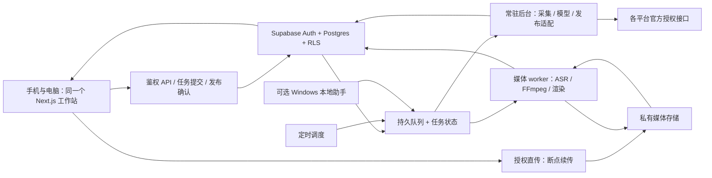
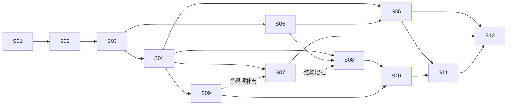

# 麦满分工作站 V2：无痛坚持自媒体

方案日期：2026-09-24。状态：完成调研的开发方案，尚未执行账号连接、数据迁移、付费开通或生产部署。

项目：`D:\projects\zimeiti-workstation`。保留现有 Next.js / React 工作站，逐步替换数据与任务底座。

## 1. 产品决定与成功标准

工作站围绕已经形成的 X 日更习惯运转：一次原创，自动沉淀，确认后复用；遇到适合口播的内容，再转成随手能拍的视频。优先减少每次发布的操作量，后台能力逐期增加。

用户已明确的决定：

- 入口为 **手机工作站 + 电脑 Web 工作站**，同一账号、同一批内容、跨端接着做。
- **X 本人原创 → 微博原样草稿 → 用户点一次确认发送**。不默认无人值守发布。
- 继续在 X 原生应用手写日更。录视频仍在准备阶段，不让视频流程增加日更负担。
- 好链接、文字、视频可以随手存入，后台拆解、分类；把结构和自己的表达结合，用于后续创作。
- 拍摄用手机，录完交给工作站，逐步实现自动初剪、成片预览和多平台发布准备。

设计目标（待上线验证，非当前实测结果）：

| 场景 | 理想操作 | 首版验收目标 |
| --- | --- | --- |
| 日更同步 | 在 X 写一次，工作站确认一次微博草稿 | 常规纯文本无需重新输入；重复点击和任务重跑不重复发 |
| 随手收藏 | 粘贴、上传或系统支持时分享进来 | 不要求先写标题、选分类、填表 |
| 准备拍摄 | 点“这条拍视频” | 默认给一份可直接念的稿、一个标题、必要的拍摄提示 |
| 交付原片 | 手机选择相册中的视频 | 显示真实进度，网络中断可恢复，不要求先改文件名 |
| 准备发布 | 看一遍初剪预览，确认成片 | 标题、文案、封面和文件已按平台准备好 |
| 长期坚持 | 首页只出现现在能做的少数动作 | 没有新内容时不催；失败可恢复；不靠每天维护看板 |

首页默认推荐每天 0～1 条适合拍摄的内容，可展开备选。没有合适素材时不凑数。视频初期可按每周 1～2 条作为产品默认节奏，用户随时调节；这是建议，不是对用户新增的任务。

## 2. 当前项目可以继承什么

本轮只读核查确认：现有项目在 `master`，GitHub 默认分支也是 `master`；仓库公开，已有多处未提交源码与本地文件。开发实施前先隔离并记录现有改动，不能把全部未跟踪目录一并提交。

| 现有模块 | 保留价值 | V2 调整 |
| --- | --- | --- |
| 今日 / 想法流 | 轻量记录、日常入口 | 首页收敛成“待确认微博 / 可以拍什么 / 成片待看”；想法流并入内容库视图 |
| 灵感库 | AI 日报、X 关注流 | 保留作外部灵感；增加原始内容对象、来源、拆解结果 |
| 创作台七阶段看板 | Topic、口播稿、个人风格档案 | 桌面保留进阶看板；日常用一张内容卡推动，自动任务代替手动拖阶段 |
| 素材工厂 | 封面生成界面与服务端调用 | 扩充资产管理、参考片段、自己的镜头、字幕和剪辑任务 |
| 发布箱 | 平台标题/标签/封面准备 | 真正区分草稿、确认、平台接收、审核、已发布及结果未知 |
| 知识库 | 本地 Markdown 的搜索、双链和图谱 | 继续作为独立知识源；以引用和受控私有索引接入脚本生成 |
| Zustand / localStorage | 现有体验与草稿缓存 | 改为界面状态和离线暂存，Supabase 成为业务数据真相源 |

必须正视的现状：

1. `scripts/fetch-x-home.py` 抓的是 Home/Following，**不是本人原创时间线**。转换时标题/摘要分别截短到 120/300 字，临时 ID 带数组序号，覆盖 `data/x-feed.json`。这份数据不能当作原文同步基础。
2. `src/types/topic.ts` 的平台仅有 `xhs / douyin / x / wechat`；`wechat` 当前明确是**公众号**。微博和视频号是两个要新增的独立平台，不能混用。
3. `src/components/publish/PublishPage.tsx` 所有发布状态写死为 `none`；“上传视频”只把文件名附加到备注，没有二进制上传。因此当前是发布物料界面，账号发布和视频处理尚未连通。
4. `src/lib/sync.ts` 仍有浏览器直连 KV 和硬编码凭据回退。`zmt:` 是命名区分，不是权限隔离。多人权限、正式发布凭据接入前必须改造；旧凭据若仍有效，需按已暴露凭据轮换，并考虑与其他系统共用实例的影响。
5. API 模型配置目前是浏览器个人配置，服务端缺少完整账号/角色边界。用户想要的“管理员配置模型，使用者不用关心”需要新的后台路由与鉴权。
6. 知识库来自本机 `D:\wiki\个人知识库\wiki`。不能为了上线而把整库复制到当前公开 GitHub 仓库；只将明确选择的资料进入私有索引，原 Markdown 保持唯一真相源。

X 定时采集当前仍在运行；本轮读到 `ZmtXHomeDaily` 最近结果为 0，`ZmtDaily9am` 为 1，后者未在本轮诊断。新本人内容同步应独立建设，不把已有新闻抓取任务当作稳定依赖。

## 3. 日常使用流程与双端界面

### 3.1 一天会发生什么

1. 用户照常在 X 发原创。后台增量同步到“我的内容”，保存完整原文和媒体。
2. 工作站自动生成微博镜像草稿。打开手机或电脑，点“确认发到微博”；目标账号、正文和媒体在同一张卡上可见。
3. 后台从新内容和收藏中挑出可口述的想法。点“这条拍视频”，生成拍摄稿；不想拍就略过。
4. 手机打开提词页面，用系统相机录制；回到对应任务上传原片。提词和拍摄可以分设备，也可先读熟再录，不强制网页一边摄像一边提词。
5. 初剪完成后看预览，必要时纠正字幕或恢复一句话。确认成片后，工作站给出抖音、视频号、小红书各自发布包。
6. 有真实发布授权的平台进入确认后发布；其他平台提供复制、下载与官方发布入口。记录发布回执/链接后，后续数据挂回这条内容。

### 3.2 首页只保留三个核心区块

| 区块 | 展示 | 默认动作 |
| --- | --- | --- |
| 待同步微博 | 本次新增原创、正文预览、目标账号、异常提示 | 确认发送；需要时编辑/跳过 |
| 今天可以拍这条 | 选题、推荐原因、预计时长、是否需要补充自己的经历 | 生成拍摄稿 |
| 继续上次的内容 | 上次稿件、上传进度、初剪预览、待发布成片 | 继续录 / 上传 / 看成片 / 发布 |

“随手存”入口常驻：链接、文字、图片、语音、视频统一提交。后台判断类型和去重，用户不必决定存哪个库。手机分享菜单接收只在设备与浏览器实际支持时启用；粘贴与文件选择始终可用。

手机底部导航：**今天、内容库、拍视频、发布、我的**。电脑导航沿用现有结构，内容库下可展开原创、收藏、结构、镜头、知识库，设置中才出现账号与模型管理。手机不展示七列横向看板。

双端使用同一内容 ID 和服务器版本；自动保存后显示“已保存”。离线文本先存本机并待同步；同时编辑时提示版本差异，不静默覆盖。手机大视频上传期间需要保持页面活跃，锁屏后能否继续由系统决定，不能承诺 PWA 后台常驻上传。

## 4. 一条原创，派生多种作品

必须把 **原始内容、创作稿、媒体文件、平台发布记录** 分开：

- 同一条 X 原创可有一份微博镜像和一份口播稿，互不覆盖。
- 一份口播作品可生成三份平台文案，并各自关联一个发布记录。
- 一次发布关联当时使用的准确文稿、视频、结构版本，复盘时能还原。
- 一条好素材可同时属于“钩子”和“证据”；不复制原视频多份，保存一个原文件及多个时间片段引用。

## 5. X → 微博：先把每天最直接的收益做出来

### 5.1 账号登记与接入边界

| 平台 | 用户给定目标 | 本期定位 | 账号状态 |
| --- | --- | --- | --- |
| X | [@Global_Funny_](https://x.com/Global_Funny_) | 原创来源；仍在 X 手动发 | 待本人授权与数字用户 ID 核验 |
| 微博 | [UID 7331277089](https://weibo.com/u/7331277089) | 原样镜像，确认后发 | 待本人授权、开发者认证与能力探测 |
| 抖音 | 抖音号 48728741515 | 后续真人视频 | 抖音号不等于 API open_id，待授权匹配 |
| 微信视频号 | 未提供具体账号 | 后续真人视频 | 待补充；与公众号分别登记 |
| 小红书 | 未提供具体账号 | 合适的视频/图文 | 待补充 |

公开主页抓取未能完成，因此不根据用户名猜内容领域、粉丝量或发文习惯。口播风格先继承用户已保存的档案；接入后用用户自己的真实原创与修改记录逐渐校准。

### 5.2 原样同步规则

- 新增专用本人时间线适配器；默认只读权限，X 写权限不在首期申请范围。
- 以平台真实 ID 去重，保存源链接、原始响应、完整长文字段、媒体顺序、发布时间、抓取时间、内容类型和编辑历史。抓取响应按平台规则留存，不把截断摘要伪装成正文。
- 首次连接先选同步起点。默认历史内容只归档，不产生待发微博，不自动补发；新的原创才生成草稿。
- 常规纯文本**不经过 AI 改写**，包括措辞、标点、换行和 emoji。不自动加标题、标签或宣传语。源链接在站内保存，不默认追加进微博正文。
- 默认跳过转推、回复他人；自回复线程单独识别。首版保持分帖结构，线程合并、引用帖、文章、投票和特殊媒体进入例外草稿，不擅自合并或删除内容。
- `t.co` 展开、跨平台 `@` 指向、超长正文、媒体数量/格式限制、缺失长文/图片等都做投递前检查；有差异就显示“需处理”。不能一边自动裁短，一边标“原样”。
- 未手工修改的待发草稿可随 X 编辑更新，但旧确认失效。用户手工改过的草稿标为“已调整”，保存其依据的源文版本；源文再变时显示差异，由用户选择沿用改稿或重新镜像，不能自动覆盖。已发布微博对应源文有修改或删除时提示用户，不再次发一条，也不跨平台自动删除。
- 日常目标为新内容约 15 分钟内入站；这是有授权、额度、网络与后台运行时的设计目标，不是无条件保证。一个增量窗口的所有分页全部持久化后才提交新的水位；分页中断保留旧水位及可用续页 token，不能第一页成功就跳过尚未归档的内容。

### 5.3 确认与防重复

默认一条内容一张确认卡，可展开批量确认明确选中的草稿。确认记录绑定目标账号、正文版本和媒体清单；内容变了就重新确认。

进入 `sending / submitted / outcome_unknown` 后冻结本次发送快照和尝试记录。此时 X 有新编辑，只新增差异待处理，不清空发送记录、不退回可直接发送的新草稿；先确认原投递结果，再由用户决定后续操作。

状态：`draft → approved → sending → submitted / published / failed / outcome_unknown`。其中 `submitted` 表示平台已接收但仍可能处理或审核；“已复制”“已上传媒体”“已打开 App”都不算发布成功。

发布意图唯一约束采用 **工作区 + 来源逻辑内容 + 目标账号 + 发布意图类型 + intent_generation**。代次默认 0；只有用户显式点击“再发一次”并确认新草稿时，由服务器创建下一代次。同一代次的重试沿用同一个 key。正文版本、payload 哈希是版本字段，不能用来自动产生新代次。X 编辑链归一为同一逻辑来源。

服务器用事务领取任务并持久化发送记录；收到平台 ID 立刻保存。明确未发出的限流/校验失败可按策略重试；发送后断网、超时等结果不明进入 `outcome_unknown`，先对账再决定。不能把任务队列的重投递等同于外部发帖“恰好一次”。

如果 API 未开通，卡片改为“复制原文 + 保存媒体 + 打开微博”，用户完成后粘贴链接。保持内容生产继续进行，同时清楚标记“待确认已发”，不伪造成功。

## 6. 好素材如何拆解并复用

截图展示的有效机制是“统一收集 → 拉片拆解 → 片段分类 → 组合结构 → 成片和数据关联”。继承这套机制，但根据个人创作者使用场景调整分类。

### 6.1 先收，再自动整理

后台依次执行：解析链接与去重 → 获取可访问正文/文件 → 语音转文字/必要关键帧与 OCR → 结构分析 → 分类和索引。纯文字无需跑视频模型；低置信度才升级视觉分析。平台链接取不到内容时保留链接，并给出一次“补文字/上传原片”的入口。

“任意链接”是统一入口的体验目标，不代表任何网站都可直接下载。支持状态分为已解析、仅链接、需登录、需补文件、失败可重试。没有视频/字幕证据时，不能编造逐秒拉片结论。

### 6.2 双层拆解

| 层次 | 默认内容 | 用途 |
| --- | --- | --- |
| 整体结构 | 目标观众、核心问题、主张、叙述顺序、节奏、成立条件 | 知道这条内容为什么能讲清楚 |
| 表达单元 | 开场钩子、痛点/问题、观察、观点、例子、证据、转折、演示、结尾/行动 | 以后能搜索、替换、重组 |

知识观点类默认结构可为“反直觉开场 → 自己的经历 → 一个证据/例子 → 得到的结论”；体验类可以是“遇到问题 → 尝试 → 结果 → 给观众的建议”。商业内容再启用“痛点 → 产品引入 → 场景 → 佐证 → 行动”。不强迫每条内容都带货或加关注号召。

每个单元保存：来源 ID、原文摘录、结构角色（可多选）、视频起止时间或文本位置、画面说明、论点/证据、适用情境、置信度、分析版本。视频卡点一下播放对应区间；文字卡跳到原文位置。

需要三类库共享检索，但含义不同：

1. **参考结构库**：别人如何开场、举例、转折；用于学习表达方法。
2. **我的表达库**：自己的 X 原创、真实经历、观点、案例、经确认的事实和风格。
3. **可用镜头库**：自己拍摄或确认可用的实物镜头、演示、屏录、B-roll；带文件和权限状态。

原素材的 `owned / licensed / reference_only / unknown` 状态必须参与后端选材规则：参考内容可以用于结构建议，但不能因进入库就被默认剪进成片。未经确认的他人画面不进入自动拼接候选；用户仍可基于参考结构重新拍摄自己的版本。

### 6.3 组合应由系统给出默认答案

用户点“按这个结构拍”，系统结合自己的原创与镜头，先给一份完整初稿。用户只在需要时替换钩子、例子或结尾，而不是从十个素材库逐项选卡。

缺素材时优先用纯口播完成；缺自己的经历时提出一个很具体的补充点，不编造“我亲测”“我赚了多少”。生成文稿要关联可核查证据；参考来源与用户本人观点分开标记。

## 7. 从 X 内容到可以立即开拍的稿子

“适合拍摄”按表达价值、可口述性、真实经验、证据完整性、拍摄难度、时效与重复程度推荐；X 互动只是一项信号，不以点赞高低机械决定。

默认拍摄包包括：

- 一句话中心观点和一个主标题；想比较时再展开少量备选。
- 默认约 60 秒口播稿，可切 30/90 秒；时长基于字数和实际语速估算，逐步按录制校准。
- 前几秒开场、正文分段、自然结尾；保留用户语气，不把每条原文扩成同样的营销模板。
- 手机提词版：大字、分句、可调滚动速度、暂停。普通人能直接照着念。
- 最少拍摄提示：哪里需要演示/屏录，哪里纯口播即可；没有 B-roll 也能完成。
- 必要事实待确认点，不把未经查证的数字藏进流畅文案。
- 成片确认后再生成各平台标题、发布文案、话题与封面字，避免脚本修改后物料过期。

手机原片与拍摄任务自动关联。多次录制标明不同 take，保留原片。初期默认“整段录，允许停顿重说”，系统辅助标记重说段落；精细分镜是可选项。

## 8. 剪辑路线：自动初剪主线，剪映作可用的精修出口

### 8.1 对三个参考项目的判断

| 项目 | 核查到的真实职责 | 采用方式 |
| --- | --- | --- |
| [OpenBiliClaw](https://github.com/whiteguo233/OpenBiliClaw) | 内容发现与只读采集，FastAPI/SQLite/浏览器扩展，MIT | 借鉴来源适配、浏览器辅助采集、统一内容结构；不把采集支持当发布支持 |
| [CountBot](https://github.com/countbot-ai/CountBot) | 多消息入口、工具调用、任务编排，MIT；其微博通道处理私信 | 借鉴任务恢复和工具权限；手机/Web 是主入口，不额外部署一整套聊天系统 |
| [OpenMontage](https://github.com/calesthio/OpenMontage) | coding agent 驱动视频制作，talking-head 管线为 beta，含转录、静音处理等工具，AGPL-3.0 | 用作口播剪辑验证参考；是否复用代码单独决策，不整体替换工作站 |

CountBot 的微博私信通道不能代替公开微博发布；OpenMontage 的 publish 阶段主要准备导出文件与物料，也不等于已接通抖音等平台。[CountBot 通道源码](https://github.com/countbot-ai/CountBot/blob/main/backend/modules/channels/weibo.py)、[OpenMontage 发布阶段](https://github.com/calesthio/OpenMontage/blob/main/skills/pipelines/talking-head/publish-director.md)。

### 8.2 推荐的首个自动初剪范围

独立后台 worker：检查原片 → 转录并取得时间戳 → 标记停顿/重说建议 → 生成可撤销剪辑决策表 → FFmpeg 渲染 → 重映射字幕时间轴 → 音量处理 → 生成预览 → 用户确认。

首版优先保守处理头尾空白、明显长停顿、字幕和响度，不自动改变论点、不强行加 BGM 或花哨转场。口误/重复句作为可撤销建议；静音检测不代表理解语义。数字、姓名、品牌和否定词优先提示校对。

默认输出适合手机竖屏的主成片，按目标平台探测结果生成需要的版本；横屏素材不默认硬裁掉演示信息，提供模糊背景/留白布局选择。保留原片、字幕、剪辑决策和版本，预览满意后才交给发布流程。

[OpenMontage talking-head 清单](https://github.com/calesthio/OpenMontage/blob/main/pipeline_defs/talking-head.yaml)提供了可参考流程；[转录工具](https://github.com/calesthio/OpenMontage/blob/main/tools/analysis/transcriber.py)使用 faster-whisper，WhisperX 为可选能力；[静音剪切工具](https://github.com/calesthio/OpenMontage/blob/main/tools/video/silence_cutter.py)标记 experimental。复制使用前需补齐每任务隔离目录、超时恢复、字幕同步测试及依赖安装；不同任务不能共享固定临时输出位置。

先用 **2～3 条用户自有口播**打通流程，随实际拍摄累计 **10 条**作为结束试用的验证集，覆盖短停顿、重说、中文夹英文、横竖屏；不要求还没开始拍摄的用户先准备十条。验收目标包括：关键字/否定词误切为 0，抽样字幕边界误差 P95 不超过 200ms，常用手机可播放；同一批原片的人工校对/精修时间相对手工基线下降（初定目标至少 30%，按样片校准后固定）。记录样例和修订点，指标未达标继续显示“初剪试用”，不能把工具存在当作自动剪辑已成熟。

### 8.3 剪映怎么用

[剪映官网](https://www.capcut.cn/)已有智能剪口播等能力，可作为第一批视频的精修工具。但本次未找到官方文档证明“剪映会员”直接授予可从工作站调用的口播剪辑 API，不能据此承诺后台自动剪。

第一版提供原片/初剪 MP4、SRT、封面、发布文案的交付包，用户导入剪映精修后回传成片；后续自动初剪成熟后不必每条经过剪映。剪映草稿工程格式、桌面自动化若要做，单独验证具体版本，不列入首期依赖。

OpenMontage 的代码为 [AGPL-3.0](https://github.com/calesthio/OpenMontage/blob/main/LICENSE)。参考架构与复制代码要分开记录；将它作为独立进程并不自动免除许可证义务。优先独立实现范围小、可测试的剪辑流程；决定复用其代码时单独评估分发与网络服务义务。[OpenBiliClaw MIT](https://github.com/whiteguo233/OpenBiliClaw/blob/main/LICENSE)、[CountBot MIT](https://github.com/countbot-ai/CountBot/blob/main/LICENSE)。

## 9. 各平台接入承诺到哪一步

调研日期为 2026-09-24；以下“条件可用”是文档支持，不代表这几个具体账号已取得能力。

| 平台 | 读取本人内容 | 草稿与发布 | 数据回流 | 默认落地方式 |
| --- | --- | --- | --- | --- |
| X | 官方用户时间线，需授权及额度 | 站内归档；用户继续在 X 发文 | 公开/私有指标按权限与时间范围 | 本人时间线只读适配器 |
| 微博 | 官方 CLI/开放能力，认证后探测 | 站内原样草稿；具备能力后确认发送 | 套餐和命令实际允许的指标 | 官方路线优先；不通则复制/媒体交接 |
| 抖音 | 需要相应应用能力和用户授权 | 代发有主体与场景门槛；分享发布是另一条路线 | 已获批的视频数据；否则报表导入 | 先发布包 + 官方发布入口 |
| 小红书 | 官方账号开放平台首期仅基础身份，不据此承诺读笔记 | 分享 SDK 可交接媒体，有文案填充限制；通用代发未核实 | 通用个人指标 API 未核实 | 手机下载/复制与 App 内确认 |
| 视频号 | 普通创作者通用读取 API 未核实 | 官方手机/视频号助手路线存在，通用发布 API 未核实 | 后台查看；导出/API需核验 | 发布包与官方后台交接 |

官方依据：[X 时间线](https://docs.x.com/x-api/users/get-posts)、[OAuth 范围](https://docs.x.com/fundamentals/authentication/oauth-2-0/authorization-code)、[微博 CLI](https://open.weibo.com/cli/quickstart)、[抖音准入对照](https://developer.open-douyin.com/docs/resource/zh-CN/mini-app/open-capacity/solutions/Life-Service-Solutions/marketing)、[抖音发布规范](https://developer.open-douyin.com/docs/resource/zh-CN/dop/operation-standard/)、[小红书账号接入](https://openaccount.xiaohongshu.com/docs/quick-start)、[小红书分享限制](https://agora.xiaohongshu.com/doc/qa)。视频号后台的依据为较旧的[腾讯官方介绍](https://training.tencentads.com/uploads/202108/0rhYyjKh_vk9HWG.pdf)，当前具体界面和权限需登录后核验，不能由旧文档推出通用发布 API。

微博是值得优先验证的新进展：官方已有 Agent CLI，需本人认证和授权；体验与正式服务能力不同，不能因登录成功就显示全功能已接通。后台应发现当前账号可用命令，再建立发布适配器。X 采用当期接口契约测试：文档存在 `post` 与历史 `tweet` 字段命名差异，原文/编辑链的字段在适配层归一，不把旧示例写死。[X 编辑说明](https://docs.x.com/x-api/fundamentals/edit-posts)。

每个账号独立显示“身份已确认 / 内容可读 / 可发哪些类型 / 指标可读 / 最后验证时间”，而非只有一个绿色已连接。Supabase 登录只登录工作站，不替代 X、微博等平台授权。

## 10. 发布表现如何回到素材库

一条作品展开后能看到：原始想法 → 使用的钩子/例子/结构版本 → 口播稿 → 原片/成片 → 各平台发布记录 → 各时间点数据。

优先抓取平台实际可得的播放/展示、点赞、评论、转发/收藏；完播率、3 秒留存、点击、粉丝转化等只有实际授权可读时才显示。缺失记为 `null / 不可获取`，不补成 0。截图上的指标仅作产品参考，不能假定所有平台都开放相同口径。

建议发布后约 24 小时、72 小时、7 天收集可用数据；额度不足则降低频率。保存指标采样时间、平台口径、来源方式（API/用户导入/用户录入），后续新增指标不覆盖历史语义。[X 指标权限与时间范围](https://docs.x.com/x-api/fundamentals/metrics)。

比较时先限定同平台、同类型与相近发布龄；“某结构常出现在表现较好作品里”是相关性线索，不宣称某个片段导致爆款。样本少时明确样本数，不给伪精确成功率。每周只给几条有证据、能指导下次拍摄的结论。

更早需要衡量的是系统价值：一次发文节省多少操作、跨端是否顺畅、每条初剪要返工多久、每周产出能否持续。数据漂亮但操作繁琐，不算本项目成功。

## 11. 技术架构与后台分工

### 11.1 保留一个工作站，后台按职责执行

推荐：Next.js 保留在现有托管环境；Supabase 承担身份、业务数据和私有资产；常驻 worker 承担定时同步、受限平台命令及视频处理。首期可以同一 worker 服务内部区分轻任务和媒体队列，不提前拆很多微服务。

任务用“固定流程 + AI 步骤”的方式：收集器只采集，拆解器输出结构，编剧输出稿件，剪辑器输出决策和成片，发布器只执行已确认的 payload，复盘器只分析真实指标。同步原文、去重、鉴权、重试和发帖均由确定性代码控制，AI 不掌握任意发帖或命令执行权。

默认 X/微博日常同步运行在常驻云端，不依赖用户电脑每天开机。Windows 本地助手可选，用于本地知识库读取、需本人浏览器会话的辅助操作或本地剪辑。它断线时云端归档与微博草稿仍应工作；等待本地执行的任务应明确排队，不能显示完成。

### 11.2 不把大视频塞进网页请求

大文件从手机直传私有对象存储，网站只签发权限、登记资产和创建任务。原片不经 Next.js 接口中转，不进入 Git。

续传区分两种情况：页面还活着时切换网络可以自动继续；页面被系统关闭或杀死后，浏览器可能无法再读取原文件，提示用户重选同一个文件，再按 hash/大小匹配上传会话。过期上传授权需重新签发，上传会话已失效则安全重建；服务端定期清理未完成的临时分片，不误删已登记原片。

上传原片保留原格式，媒体 worker 识别 iPhone 常见 HEVC/MOV、旋转信息、可变帧率及 HDR；产出正确方向、音画同步、适合手机预览的 H.264/AAC MP4。需要 HDR→SDR 映射时保留转换记录，不用简单改扩展名代替转码。先实测用户常用系统；宣称 iOS/Android 均支持前，两类设备都要覆盖。

Supabase 提供 TUS 断点上传与私有桶访问控制；Vercel Functions 有请求体和运行时限制，Supabase Edge Functions 也有 CPU/内存/时长限制。因此长时间转录、转码采用独立 worker，是本方案的工程选择。[断点上传](https://supabase.com/docs/guides/storage/uploads/resumable-uploads)、[私有桶](https://supabase.com/docs/guides/storage/buckets/fundamentals)、[Vercel 限制](https://vercel.com/docs/functions/limitations)、[Edge Functions 限制](https://supabase.com/docs/guides/functions/limits)。

上云前用用户常用手机的 Wi-Fi 和移动网络做上传/播放小样验证。若跨境访问稳定性不能满足日常上传，媒体层保留可替换接口，评估国内对象存储；账户和任务模型不随存储厂商变化。暂不在未实测前承诺国内网络体验。

### 11.3 最小数据契约

以下为目标实体，不要求第一期建齐所有表。每个业务对象都有 workspace/owner 范围、创建与更新时间；可重试任务用服务端唯一键，不靠前端按钮禁用去重。

所有平台远端 ID 均以字符串存储和传输，尤其 X 的长数字 ID；不得经过 JavaScript `Number`。数据库主键、平台账号 ID 与用户看到的昵称/抖音号分别保存。

| 实体 | 关键字段/约束 | 首次需要 |
| --- | --- | --- |
| workspaces / members | user_id、角色、明确发布权限 | 基础权限 |
| accounts | platform、稳定远端 ID、显示名、secret_ref、能力及最近探测结果 | 本人同步 |
| source_items / source_revisions | 来源、作者、逻辑 ID、远端版本 ID、完整正文、编辑链、关系、原链接、hash、historical_import | 原创归档 |
| assets | 私有对象路径、文件 hash、媒体类型、时长/尺寸、上传状态、来源、可用范围 | 图片同步及视频 |
| source_assets | 原始内容与媒体的有序关联、版本绑定 | 原样媒体顺序 |
| projects / project_versions | 继承 Topic 的 ID、标题、风格、脚本、来源引用、版本 | 旧数据迁移/拍摄稿 |
| segments | 源文/原片 ID、时间/文字范围、结构角色、转写、置信度、分析版本 | 拆解库 |
| recipes / recipe_steps | 可复用结构、角色顺序、约束 | 按结构组合 |
| compositions / composition_items | 本次作品所用结构及片段的冻结版本、重写关系 | 复用与效果追踪 |
| production_tasks / edit_versions | 拍摄包、takes、时间轴决策、字幕、输入/输出资产、引擎版本 | 手机与初剪 |
| publication_variants / publications | 目标账号、镜像/改编、正文/媒体快照、确认、投递状态、平台 ID/URL、意图唯一键 | 微博闭环 |
| jobs / job_attempts | 类型、输入版本、去重键、租约、重试、进度、费用、错误、结果未知 | 所有异步任务 |
| metric_snapshots | publication_id、采样时刻、字段定义、可得值、来源 | 复盘 |
| model_routes / usage_events | 任务类型→模型、管理员配置、单次/日/月预算、用量 | 模型后台 |
| audit_events | 连接/授权/确认/发送/撤回/配置变更的操作记录 | 第一轮真实发布 |

迁移平台枚举时：旧 `wechat` 映射为 `wechat_official`，新增 `weibo` 与 `wechat_channels`；不把历史公众号物料改名成视频号。一个 project 的“完成”是概览，不替代每个发布记录的独立状态。

适配器契约建议：

- `SourceAdapter`：校验账号归属、分页增量、获取完整原文与媒体、返回真实同步水位。
- `PlatformAdapter`：`probeCapabilities / validate / publish / reconcile / fetchMetrics`。只有通过验证的能力可执行；原生草稿接口不作为所有平台共同前提。
- `EditingProvider`：`submit / status / preview / cancel / export`，输入固定资产与决策版本，输出资产引用。
- `KnowledgeProvider`：只读查找与引用，按选定范围同步；不把知识库目录当业务数据库。

### 11.4 持久任务与发布一致性

采用 Postgres 的持久队列能力（可选 Supabase Queues/pgmq）配合 jobs 状态表：入库和入队在同一事务内完成，避免“内容保存了但没触发后续”的空档；队列用于派工，jobs 用于可见状态与审计。[Supabase Queues](https://supabase.com/docs/guides/queues)。

每次执行租用任务，长任务续租；无外部副作用的分析/渲染任务超时可恢复，并以输入 hash/版本复用成功产物。**发布任务例外：`sending` 状态租约过期或 worker 崩溃后，只能转 `outcome_unknown` 并恢复对账，不能重新执行 publish。** 这包括平台已接收、但本地尚未来得及保存回执的崩溃窗口。模型失败有有界重试和任务级备用模型；重试有次数和费用上限。渲染文件先写独立临时路径，完整校验后原子登记结果；取消任务不删除原片。

浏览器关掉后任务照常运行，重新登录读取服务器进度。通知默认只出现在工作站：需要确认、已完成、持续失败、额度不足或授权失效时才提醒；单次后台重试不打扰。手机 Push 是可选增强，不作为流程可用性的前提。

### 11.5 统一后台模型与权限

管理员按任务选择模型：文本分类、结构拆解、写稿、多模态拉片、ASR、封面分别路由。使用者只看到“拆解”“生成稿”“开始初剪”，不用挑大模型。默认不为每次微博镜像调用模型，不为纯文字分析调用视频模型。

角色建议先做 owner、editor、viewer；发布权为显式权限，第一期仅 owner 可确认发帖。前端隐藏按钮之外，API、数据库和对象存储都检查权限；发布 worker 校验确认者、目标账号和 payload 版本。

Supabase Auth 配合 RLS 与最小权限授权，密钥/平台 token 保存在服务端秘密存储，客户端只接触允许公开的项目配置和用户会话。service_role 不进浏览器；平台授权可单独撤销，撤销后未执行发布任务停止。RLS 需要跨用户与未登录测试验证，不能仅凭“用了 Supabase”视为权限安全已完成。[RLS](https://supabase.com/docs/guides/database/postgres/row-level-security)、[密钥与数据保护](https://supabase.com/docs/guides/database/secure-data)。

外部正文、视频字幕和仓库内容全部作为待分析数据，不执行其中的指令。抓取器限制 URL 协议、私网地址和重定向；媒体校验真实类型和体积。管理员模型地址采用批准列表与服务端网络约束，不能把旧版任意客户端 Base URL 当新后台入口。

## 12. 迁移策略：保留内容和日常使用

1. 基线登记：保存当前源码差异清单；区分前轮改动、用户改动、缓存与嵌套仓库。现有代码能构建不代表业务全部打通。
2. 建新的鉴权与读取适配层；S02/S03 先在预览环境部署登录、工作区、RLS、导入工具并联合验证。生产旧 KV 写入口停用、凭据轮换与新存储切换在同一个迁移窗口完成，不能在导入能力完成前先让旧工作站失去写入；等待期间优先使用兼容的已鉴权服务端代理隔离浏览器凭据。
3. 同时考虑每台现有浏览器的 localStorage 和云 KV：任一端可能有未同步内容。提供导出/导入，保留旧 ID，按 hash 和更新时间比对冲突；不同稿件并存供选择，不静默覆盖。
4. 新项目实体暂兼容原 Topic；验证条数、平台、时间、稿件和物料引用。导入操作幂等，重复导入不翻倍；记录导入批次与错误。
5. 切换后只写 Supabase；Zustand 作为缓存。避免长期向 KV/数据库双写而产生两份真相。
6. 回滚以冻结后台写入、导出切换后的增量并恢复兼容读取为准；不回滚到公开 token 模式，不通过恢复旧页面丢掉新内容。
7. X 原创更新走数据库和队列，不再“改 JSON → 提交 Git → 部署”。旧关注流先保留，后续再迁到同一采集底座；日常采集不能触碰代码暂存区。
8. 原 Obsidian 库保留本地。云端只持有被选中的私有检索内容与引用；知识库完整云同步单列后续能力，不阻塞 X→微博。

## 13. 开发顺序与可验收交付

本轮交付是方案；以下 12 个步骤是实施计划，尚未执行。每一步控制为可独立审阅、可通过开关回退的改动；S03 明确拆为两个子 PR，S07 音视频增强后置，不把大块跨模块改动塞进单个 PR。模型复杂度标注用于任务分配，不意味着后台模型需与开发模型相同。

通用开发约束：基于明确的当前源码快照建 `feat/maimanfen-v2-*` 分支，逐项纳入已有改动；禁止直接全量暂存本地缓存、凭据、数据备份或原片。默认向 `master` 提交独立 PR，但创建/合并/生产部署属于实施阶段的交付动作，本轮不执行。公开仓库只放源码与脱敏测试样例。

现有验证命令为 `npm run build`。本计划中的单元、权限和端到端测试需要在对应步骤新增后才可执行；不能宣称仓库现已有这些测试。每个 PR 的 CI 至少执行构建和本步新增的针对性测试；真实账号发布在预览闭环完成、用户点击明确测试草稿后才验证。

### S01｜确认账号能力与保存开发基线

- **上下文**：Next.js 工作树已有未提交功能；X 只有关注流抓取；账号 URL 不能证明已授权。用户只同意未来“原样草稿后一次确认”，主入口为手机与 Web。
- **范围**：基线差异/备份清单、账号能力记录格式；核查 X 开发者访问、微博官方服务资格、手机网络与上传小样路线；识别既有系统共用 KV 依赖。仅原型/文档或隔离开发脚本，不触发真实发布。
- **依赖与复杂度**：无；强推理，决定后续契约。
- **文件责任**：`plans/`、隔离能力探测样例；不改原任务计划、不读取或输出旧密钥值。
- **验证/出口**：`npm run build` 建基线；记录每项能力的证据、账号关联、未满足条件。若微博资格待开通，正式记录人工交接路线，后续 UI 可以继续建设。
- **回滚**：无运行时改动；保留基线资料。

### S02｜登录与服务端权限边界

- **上下文**：当前无完整登录鉴权，KV 浏览器凭据和浏览器自带模型配置不适合正式发布。不要先把社交 token 塞进旧链路。
- **范围**：Supabase Auth、workspace/member、RLS、API 身份检查、模型配置 owner 权限、服务端 secrets 引用；旧凭据处理计划执行到可验证状态；增加权限测试基架。
- **依赖与复杂度**：S01；强推理/权限评审。
- **文件责任**：新增 `src/lib/auth/`、`src/lib/db/`、`supabase/migrations/`、登录页面与 API 保护层；修改配置时不提交真实值。
- **验证/出口**：预览环境构建与权限测试；未登录不能调用付费或发布接口，非成员无法读取工作区，editor 无法读取 secret 或确认 owner-only 发布，私有资产不能跨用户下载。准备鉴权兼容代理与旧凭据轮换；生产旧写入口的停用和 S03 数据切换一起验收，不能单独先切断。
- **回滚**：关闭新功能并保留数据；不可恢复暴露凭据作为降级。

### S03｜内容模型、旧数据导入与持久任务

- **上下文**：Topic、Thought 已存在于本机和 KV；浏览器 fetch 的所谓后台生成无法跨关闭恢复。Supabase 身份边界已由 S02 建好。
- **范围**：先冻结 accounts/sources/projects/assets/publications/jobs 首期最小契约，再分两个子 PR：**S03a** 完成旧内容导入、冲突报告、兼容读取、Zustand 数据缓存与平台枚举迁移；**S03b** 依赖 S03a，只实现采集/镜像/发布所需队列、任务状态和 worker 最小循环。旧 AI 生成转持久任务随 S08/S10 实现，不阻塞 M1。
- **依赖与复杂度**：S02；强推理/迁移评审。
- **文件责任**：`src/types/`、`src/store/`、`src/lib/repositories/`、`src/lib/jobs/`、`workers/`、迁移与导入工具。
- **验证/出口**：S03a 构建、导入两次数量不变、冲突稿可见；S03b 构建、worker 重启后采集任务恢复、浏览器关闭后任务结果可取、租约过期不重复派发外部发布；确认后版本变化不能沿用旧授权。两个子 PR 都完成后与 S02 联合生产切换，再令旧公开 KV 写入口失效并核验关联系统正常。
- **回滚**：停 worker、导出新增数据、切兼容读取开关；保留原始导出，避免长期双写。

### S04｜手机与 Web 的日常首页

- **上下文**：当前固定侧栏和横向七列看板不适合手机。服务端内容与任务契约由 S03 提供。
- **范围**：响应式导航、三个首页区块、随手存入口、内容卡详情、任务进度、跨端自动保存；保留电脑进阶看板。
- **依赖与复杂度**：S03；常规，可与 S05 并行。
- **文件责任**：`src/app/layout.tsx`、`src/components/layout/`、今日与内容库页面、客户端查询与草稿缓存层；不改连接器。
- **验证/出口**：构建；360～430px 手机上无横向挤压，电脑可继续已有任务，两设备编辑冲突可恢复；离线文本恢复不丢；所有待办均源于真实状态。
- **回滚**：界面开关回到原桌面布局，业务数据保持新存储。

### S05｜本人 X 归档与微博原样草稿

- **上下文**：旧 X feed 只供灵感，不可复用作原文归档。已有 Source/Revision 契约和 queue；用户仍在 X 原生应用发文。
- **范围**：官方只读 OAuth、数字用户身份核验、增量分页、完整长文与媒体、编辑链、原创/回复/转推分类、历史不补发、镜像草稿投递前检查。
- **依赖与复杂度**：S03；强推理；与 S04 仅共享冻结的契约。
- **文件责任**：新增 `src/lib/connectors/x/`、`src/lib/mirroring/`、账号回调与后台任务；不改旧 `fetch-x-home.py` 的新闻行为。
- **验证/出口**：构建+契约测试：置顶不重复、页面顺序变动不重复、历史不产生微博待发、中文 emoji/长文不截断、编辑归一、失败不推进游标；有真实授权时核对至少一篇本人原文及媒体完整性。
- **回滚**：停本人同步调度，保留归档；现有 X 手工日更不受影响。

### S06｜微博确认发送与回执

- **上下文**：S05 已生成不可变版本可追踪的镜像草稿；S04 已有手机/电脑确认卡。官方能力须由该账号实际开通。
- **范围**：微博 OAuth/官方 CLI 或接口适配、当前命令能力探测、一次确认、发送尝试记录、结果未知对账、历史和编辑防重；人工交接降级。
- **依赖与复杂度**：S04 + S05；强推理/发布副作用评审。
- **文件责任**：`src/lib/connectors/weibo/`、`src/lib/publishing/`、确认 API、发布箱卡片、相关 worker。
- **验证/出口**：构建；模拟双击/并发/超时/平台审核中不重发，覆盖“平台已接收但本地保存回执前崩溃”；发送租约过期只对账；只发送用户确认的版本与目标账号；至少一条用户明确确认的真实测试发帖取得回执或真实可核验链接。不能仅凭打开发布页验收自动发布。
- **回滚**：停止发送任务，保留已发回执；切回原样复制交接。结果未知任务不自动重跑。

**里程碑 M1：X 日更能沉淀并省掉微博重复输入。** 官方资格已具备时目标交付确认后发送；资格未到位则明确交付草稿/人工交接，自动发送仍记待办，不虚报闭环完成。

### S07｜统一收藏、拆解与结构库

- **上下文**：Sources 与 assets 已可持久保存；需要将截图的“片段入库”变为适合个人表达的复用工具。
- **范围**：链接/文字先行，已有可访问图片按需分析；结构角色、文字位置、证据与来源、许可范围、去重、检索、组合结构模板。音视频先登记待解析，S09 真上传后再补同一模块的视频分析，不以音视频完整能力阻塞文字库。
- **依赖与复杂度**：S03 + S04；常规编排，视频分析使用强推理；可与 S05/S06 后半段独立推进。
- **文件责任**：`src/lib/ingestion/`、`src/lib/analysis/`、素材与结构库组件、segments/recipes 迁移。
- **验证/出口**：首版构建与文本/图片/失效链接样例；片段能跳原文，音视频待解析状态真实；模型幻觉字段被校验；同素材重分析保留版本。S09 后补充语音/视频样例及区间播放验收，reference_only 画面不能成为自动渲染输入。
- **回滚**：关闭新分析任务，原链接与文件保留；既有分析结果只读可查。

### S08｜一键拍摄稿与提词页

- **上下文**：自己的 X 原创已完整归档；风格档案可以继承；用户希望少选择、直接录。自己的原创可以直接出稿，无需等待整套外部素材库。
- **范围**：推荐候选、纯口播默认稿、内置结构模板、版本化引用、手机提词、标题与必要拍摄提示；此时将脚本 AI 生成迁至持久任务，缺少本人经验时简短补问。S07 完成后再接外部结构重组与检索增强。
- **依赖与复杂度**：S04 + S05；常规，质量评审需强推理。S07 是增强依赖，不阻塞首版。
- **文件责任**：创作服务、`src/app/shoot/`、提词组件、project/composition 版本关联。
- **验证/出口**：构建；从一条原创到可读提词稿无需维护看板；不编造经历/数字；改稿不覆盖原文，引用能回查，手机字号/暂停/恢复可用。
- **回滚**：保留现有手工稿编辑，关闭自动推荐；已生成脚本照常可读。

**里程碑 M2：随手收藏能拆，选中一条就能拍。**

### S09｜手机真上传与媒体任务

- **上下文**：原“上传视频”只是记录文件名；assets/队列已存在，需要真正承接相册文件。
- **范围**：私有存储、断点直传、文件校验、take 管理、任务关联、预览与删除策略、网络中断恢复；原片/成片分开。交付后再补 S07 的音视频入库与分析验收。
- **依赖与复杂度**：S03 + S04；常规；可与 S07/S08 并行，通过 project_id 关联。
- **文件责任**：上传组件、授权上传/完成 API、存储适配、媒体 worker 输入检查。
- **验证/出口**：构建；按配置允许的真实手机视频在 Wi-Fi/移动网络完成上传、播放和任务关联；覆盖页内切网、页面被杀后重选原片、授权过期恢复；不生成重复资产。先测用户常用手机，双平台支持需 iOS Safari 与 Android Chrome 都验证；HEVC/MOV、旋转、VFR/HDR 转为可播放预览且音画同步；未登录/跨工作区访问拒绝；大文件不流经 Next.js 请求体。
- **回滚**：关闭新上传，已传原片仍可下载；不删除原始资产。

### S10｜真人口播保守初剪

- **上下文**：用户的真实原片已可上传；OpenMontage 的相关能力仍需工程化验证，剪映可作手工出口。
- **范围**：先 2～3 条自有样片贯通，随真实使用累计 10 条验收；ASR、可撤销决策、静默剪切、字幕重映射、音量处理、竖屏预览、独立任务目录、持久 AI/渲染任务与失败恢复、剪映交付包；复用第三方代码前记录依赖/许可决定。
- **依赖与复杂度**：S08 + S09；强推理/媒体工程。
- **文件责任**：`workers/media/`、`src/lib/editing/`、剪辑预览与版本组件，不改平台发布适配器。
- **验证/出口**：构建+样片对照；按 8.2 固定的 0 关键语义误切、字幕 P95 边界误差≤200ms、人工返工耗时目标验证；渲染重跑产物幂等，手机可播，旧剪辑可恢复。达不到要求保留试用标识和剪映出口。
- **回滚**：停自动剪辑，用原片/字幕交付包继续制作；保留全部输入与决策。

**里程碑 M3：手机录完交进来，能得到可预览、可修订的成片。**

### S11｜视频平台发布包与按能力接入

- **上下文**：一份确认成片要发抖音、视频号、小红书；平台授权与手机分享能力不同。
- **范围**：平台账号独立登记、标题/正文/封面/文件准备、设备支持下的分享、可靠下载和复制；逐平台能力探测后开启官方发布/读回，不以统一“已连接”掩盖差别。
- **依赖与复杂度**：S06 + S10；常规，平台接口评审。
- **文件责任**：发布箱、平台物料生成服务、各自 `connectors/` 子目录；保留公众号兼容，不冒用其 API。
- **验证/出口**：构建；同一成片派生独立文案但不改原作品；每个平台至少走通实际支持的交接；发布状态来自回执/用户确认链接；一个平台失败不影响其他成功记录。
- **回滚**：单平台停用自动能力，使用交付包与链接登记。

### S12｜指标关联、周复盘与持续使用验收

- **上下文**：已有可靠 publications 和 compositions，才可以把结构与数据关联；不同平台指标不齐全。
- **范围**：低频指标采集、导入/录入、null 语义、结构版本归因视图、每周简报、错误提醒、成本面板；串起完整双端旅程和 7 天试用反馈。
- **依赖与复杂度**：S06（微博基础指标可先做），完整交付依赖 S07 + S11；常规，数据解释需强推理。
- **文件责任**：`src/lib/metrics/`、`src/app/review/`、周报与管理员费用视图。
- **验证/出口**：构建+双端端到端；所有指标能追到真实发布与采样来源；缺失不变 0；不同结构/平台不做伪因果比较；用户连续使用后验证省时、返工和提醒负担。
- **回滚**：关闭指标调度与推荐学习，保留原始快照及手工数据。

**里程碑 M4：内容、素材、发布和复盘互相连通，同时保留少操作的日常体验。**

### 依赖与并行边界

基础数据契约先冻结；S04 界面与 S05 X 适配可并行。S07 素材拆解与 S09 上传互不争文件，可以并行。S06 的结果未知处理需要统一设计，不能由两个独立发布器各自维护状态。所有共享 schema 和权限改动由一位负责人合并。

## 14. 时间、费用与范围控制

工作量先按里程碑评估，不承诺所有平台同日全自动上线。粗略工程估计：M1 约 6～10 个开发日；M2 增量约 4～7 日；M3 增量约 6～10 日；M4 增量约 4～7 日。它们不是报价或日历承诺，平台审核/本人授权等待不计入；样片质量、真实网络、现有数据冲突可能调整范围，并行工作可缩短日历时间。

费用拆成固定运行、平台 API、模型调用、媒体存储/流量与渲染时长。管理员预设月预算和单任务上限，超限暂停新付费任务，保留手工创作/同步交接。首次先小批量验证，不为未录制的视频预买大规模推理资源。

目前核查的价格信号：X 为预充值按量模式，普通 Posts Read 与符合条件的 Owned Reads 单价不同；本人授权不必然等于 Owned Reads，要满足应用所有者等条件。微博官方有体验与充值服务，正式积分包起价为 ¥69，这不是月费；体验不包含全部多图与统计能力。实施时以控制台实际条款与额度为准。[X 价格](https://docs.x.com/x-api/getting-started/pricing)、[微博 CLI 说明](https://open.weibo.com/cli/quickstart)。

最小成本规则：原样镜像零模型调用；文本优先；按内容 hash 缓存拆解；关键帧按需抽取；渲染失败从成功阶段续跑；相同原片不重复上传；每个平台指标低频采样。原片清理要显式配置保留期并可恢复，不为省空间默认删用户素材。

首期不纳入：跨平台自动评论/私信、批量增长机器人、完全无人值守发布、AI 数字人替代真人、复杂多轨专业剪辑器、原生 App、多聊天机器人入口、知识库整库公开同步。它们不会阻塞已经明确的 X→微博和真人拍摄主线。

## 15. 实施前的信息与可继续工作

已经明确：双端工作站、X 原创来源、微博原样草稿后一键确认、三个给定账号标识、视频平台顺序、保留旧项目继续开发。

实施时按需要完成的一次性设置：X 与微博本人官方授权/资格开通；视频号和小红书的具体账号；常用手机系统；可用的月预算；首批自有口播样片。这些不妨碍界面、数据结构、草稿机制与手工交接先开发；不要求现在发账号密码、Cookie 或密钥到聊天里。

下一次开发的明确起点：按 S01 保存并审阅现有基线，随后 S02/S03 先补身份、数据和任务持久化，再并行完成手机首页与 X 本人归档。第一轮交付以 M1 为边界，后续逐步打开素材拆解与视频能力。

## 16. 方案维护与评审记录

本文件是新阶段开发入口；`CLAUDE.md` 继续记录旧项目事实。阶段拆分、顺序调整或外部接口变化时，在此记录日期、证据、影响步骤和新版验收条件。可拆分/插入/延后步骤，但不可删掉原文保留、用户确认、防重复、跨端恢复和真实回执这些不变量。

正式实施须遵守：所选平台能力没有实测证据就标待验证；每次发布绑定用户确认；任何模型输出不能凭自己触发发帖；遗留数据和账号令牌不能进入公开仓库。

评审记录（2026-09-24）：独立架构复核通过，平台能力文档复核通过。已处理手工草稿被覆盖、发送中快照冻结、所有分页后推进水位、显式重发代次、远端 ID 精度、发布崩溃后只对账、旧 KV 切换窗口、任务拆分与依赖、手机续传/格式兼容、剪辑量化验收等意见，复查无剩余重大问题。这表示方案可进入开发，不代表平台能力或产品效果已实测通过。无生产操作；接口权限、网络和剪辑质量仍须在实施阶段实测。
